# 第三版截图

来自 tests/capture_v3.gd 的实际 Godot 渲染。测试档为示例构筑，不是玩家存档。

## v3-abyss-rest

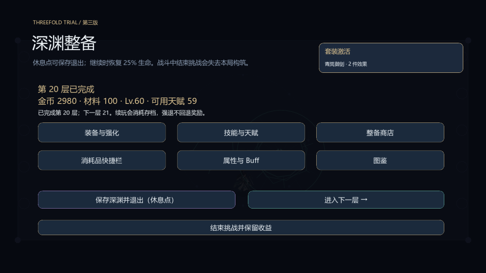

## v3-abyss-save

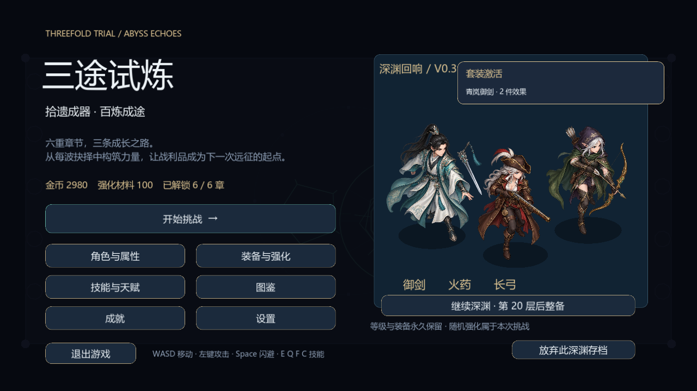

## v3-bindings

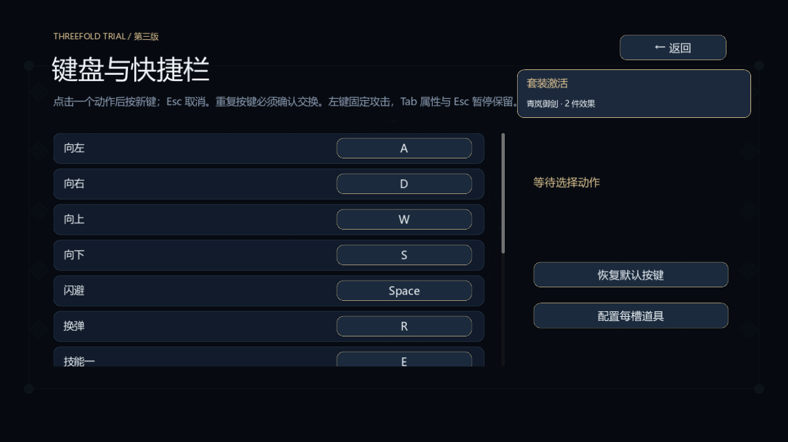

## v3-buffs

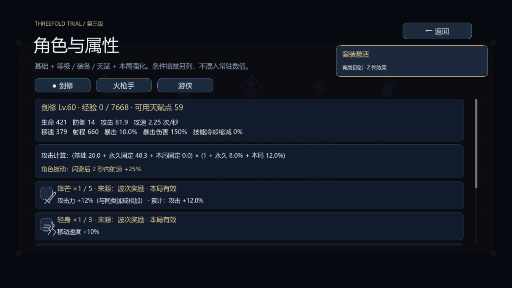

## v3-chapters

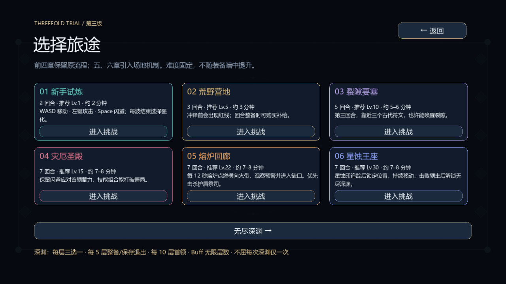

## v3-characters

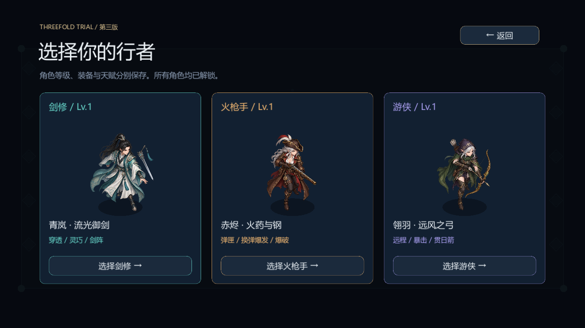

## v3-codex

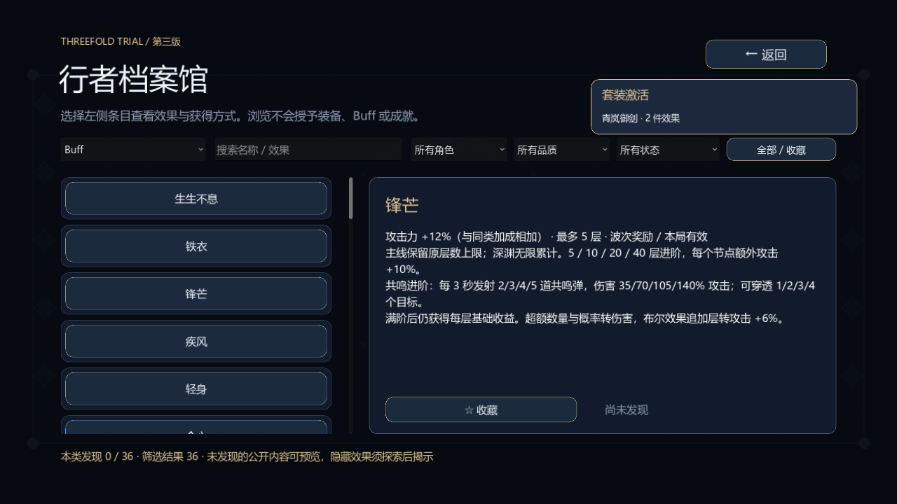

## v3-combat

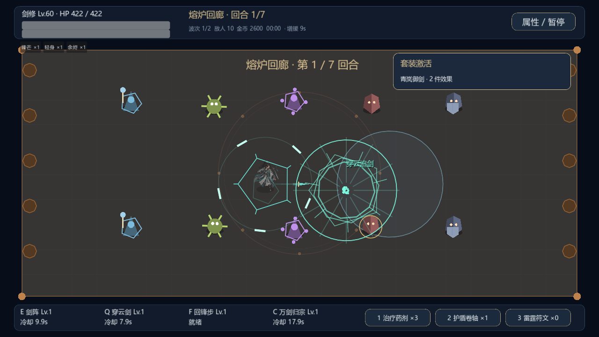

## v3-equipment

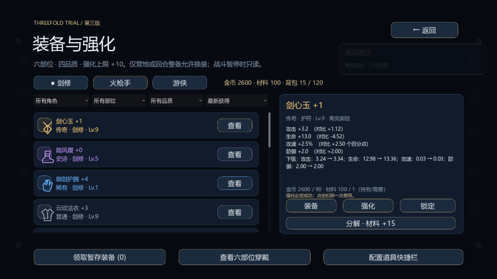

## v3-intermission

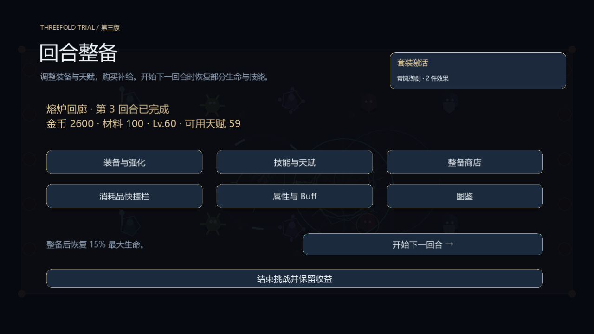

## v3-menu

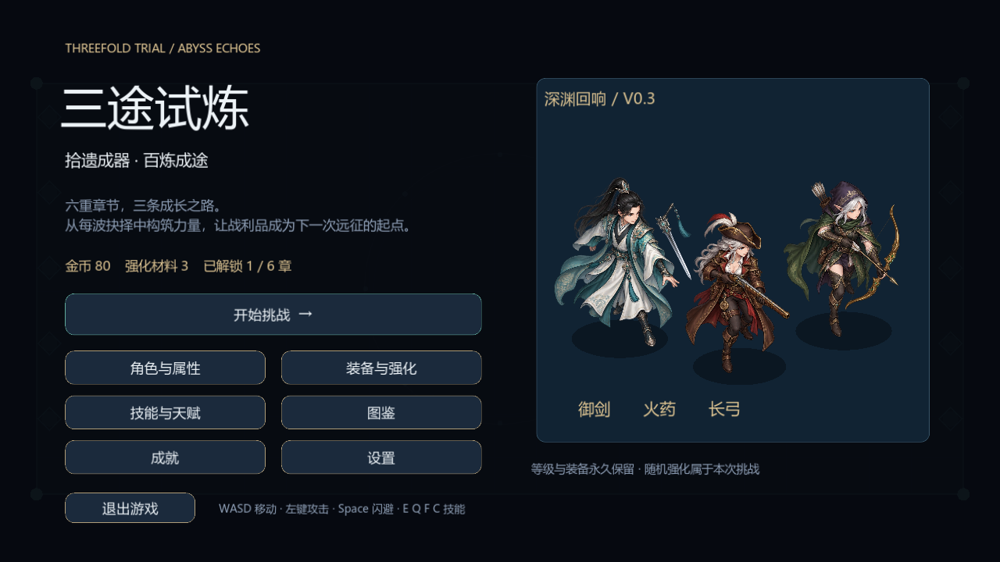

## v3-result

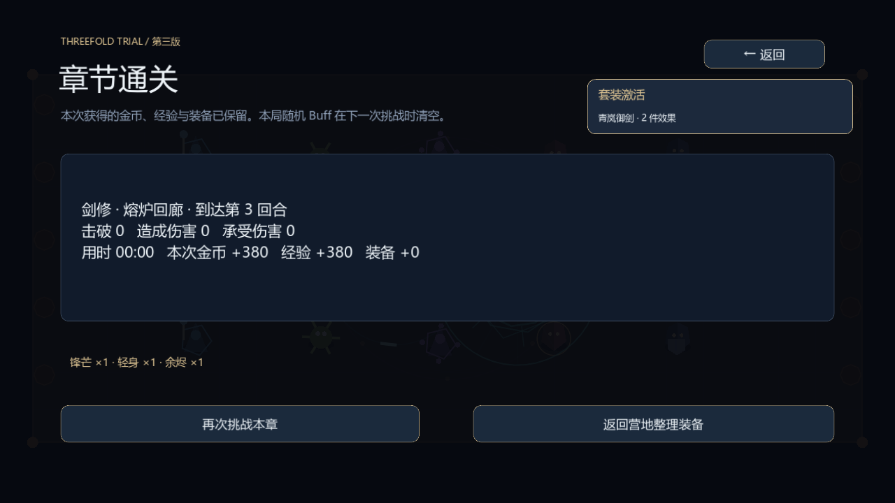

## v3-rewards

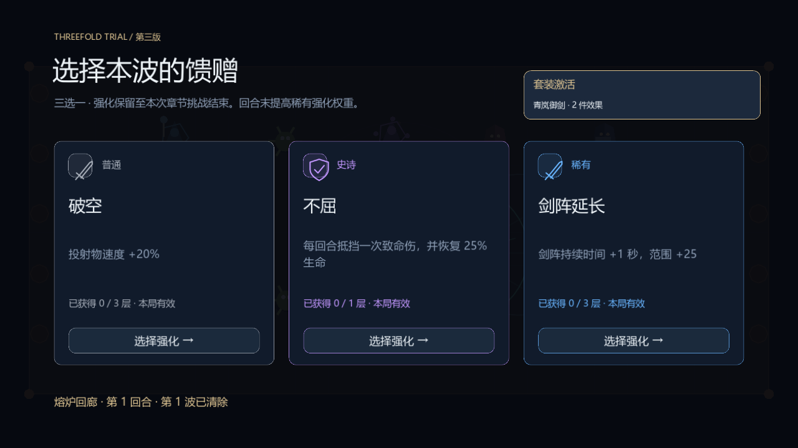

## v3-settings

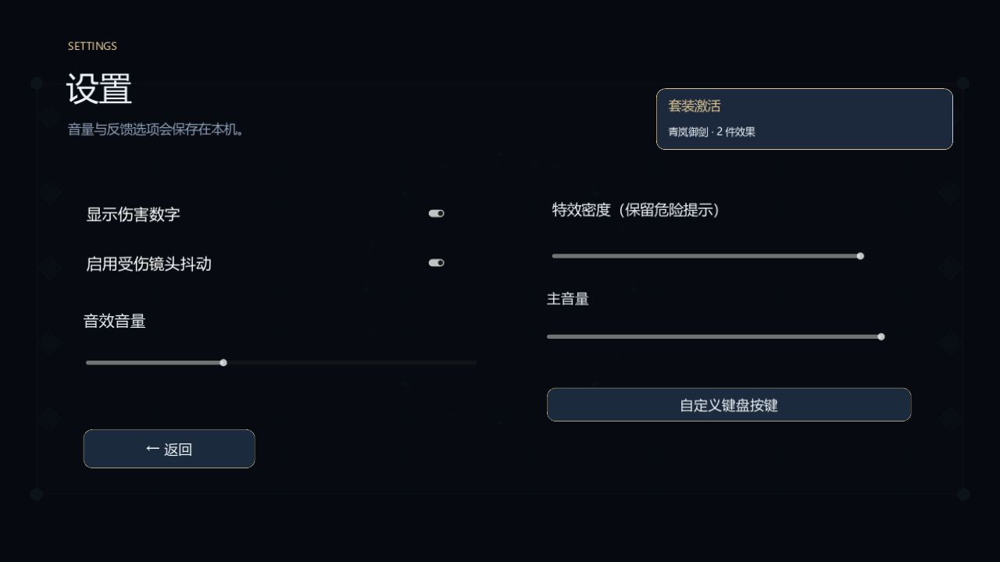

## v3-shop

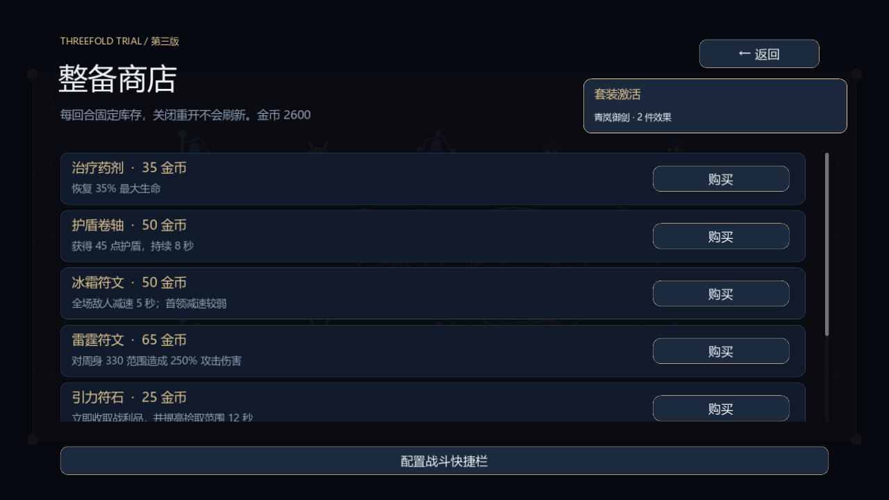

## v3-talents

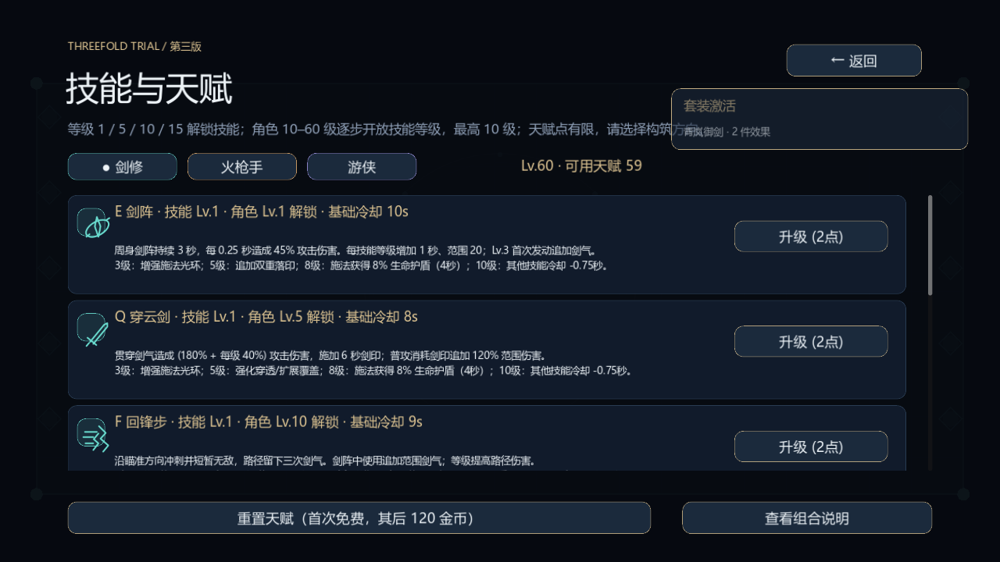
