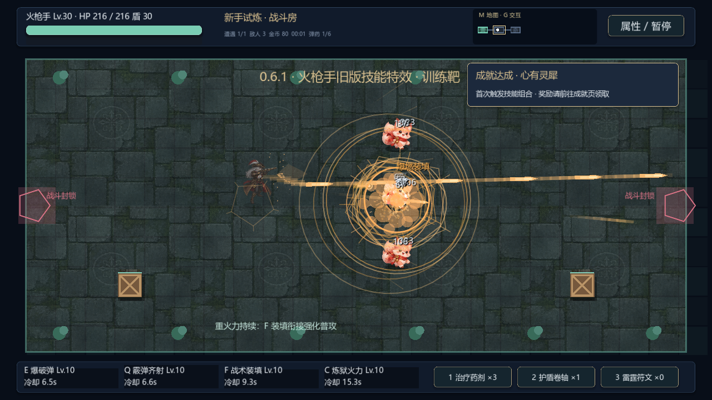

# 0.6.1 · 火枪手表现回退与游侠音效调整

按本轮游玩反馈，以第五版 0.5.0 为回退参照，使用保留的 `sound.gd` 原始音效生成器。

- 火枪手：普攻、装填、爆炸、连携及 C 技能各阶段恢复旧版音效；命中/暴击也恢复旧声，移除新增长爆破采样叠层。
- 火枪手：恢复旧版弹道主体、粗亮尾迹、C 枪口闪光、爆炸环与火花；关闭该职业新增的贴图火焰、烟团、爆炸和命中贴图层。检视室同步使用回退后的效果。
- 游侠：普攻、巨箭、连携、C 各阶段以及命中/暴击恢复旧版音效，移除木材吱呀声叠层。保留当前箭矢画面。
- 人物与武器完整帧、正确的出手位置、贴墙遮挡修复、剑修与噜噜的音画继续保留。

不改变伤害、冷却、技能解锁、掉落、存档格式和按键。版本号为 0.6.1。

## 本次验证

59 项定向检查通过：实际选中的播放流与旧版波形一致、没有叠加新采样、火枪手贴图粒子关闭、C 枪口仍可见，剑修/噜噜继续使用其新音效。

36 项技能集成检查通过；三职业静止/移动伤害与连携次数逐项对比回退前结果完全一致。实际渲染运行 E/Q/F/C 及普攻，截图如下。测试用隔离内存档；音频验证基于波形与播放通道，未代替主观试听。

日志在 `test-logs-v061`。自动音频检查结束后等待混音线程清理，以免快速播放/停止造成测试退出时的资源滞留提示；最终复测正常。受限环境仍有系统证书读取提示。

0.6.0 的性能报告、截图、录像和交付校验属于历史版本；这次没有重新进行全关卡通关或压力测试。当前打包记录见 `DELIVERY_CHECK_V061.json`。
