# 第四版实际游戏截图

以下由 Godot 4.7.2 真实渲染。角色与技能展示使用隔离测试档；技能级别已在HUD显示。

## menu

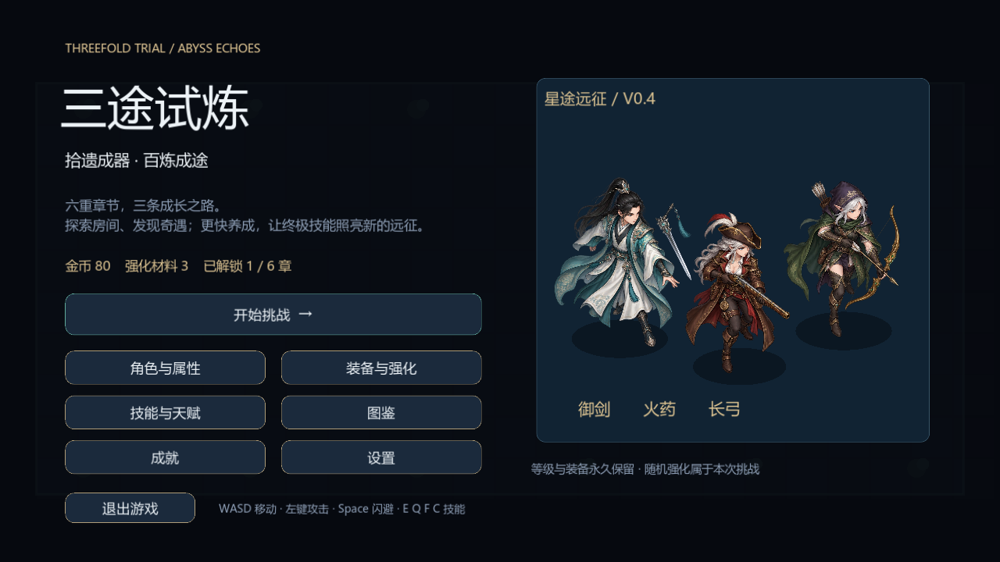

## chapters

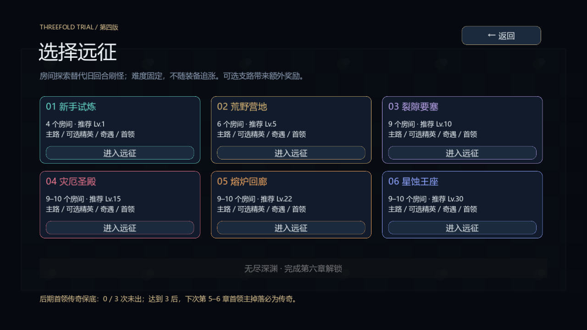

## giant-0

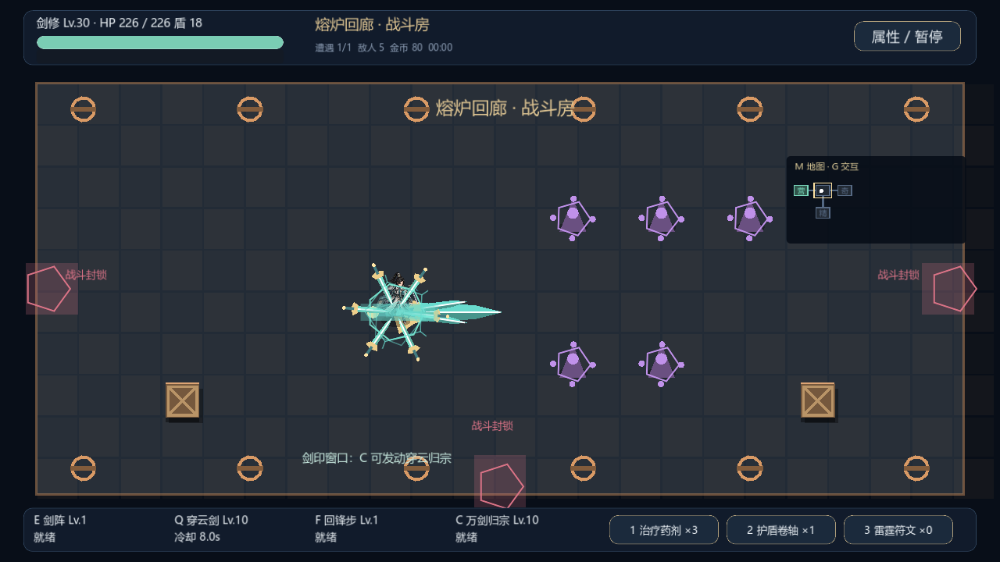

## ultimate-0-active

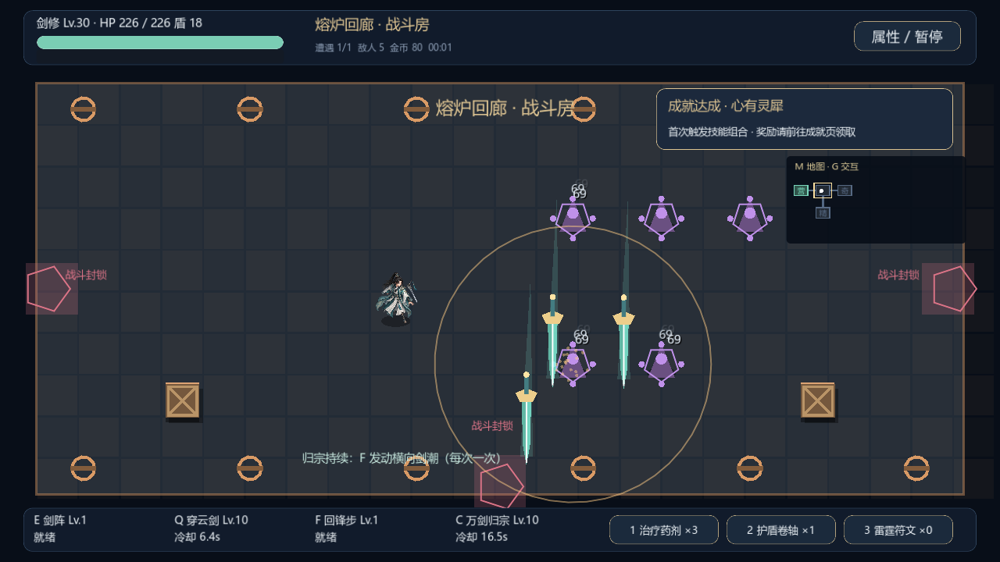

## ultimate-0-finish

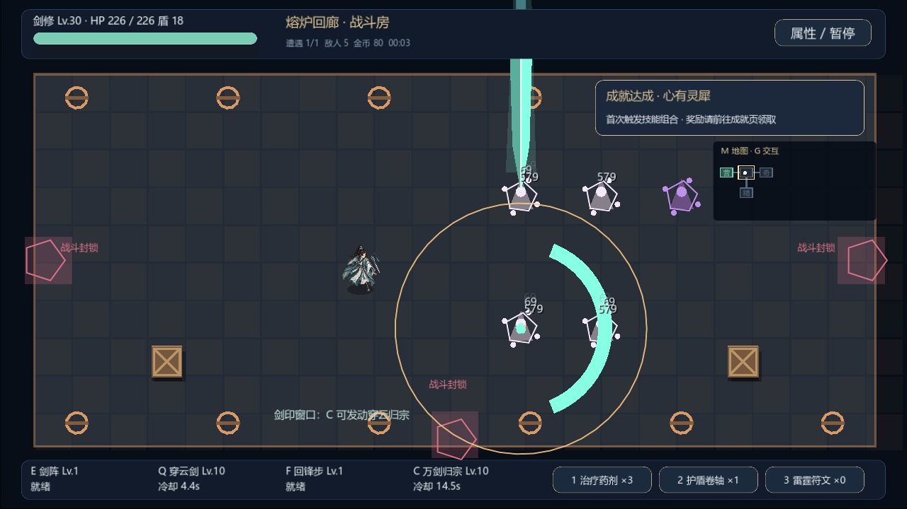

## ultimate-1-active

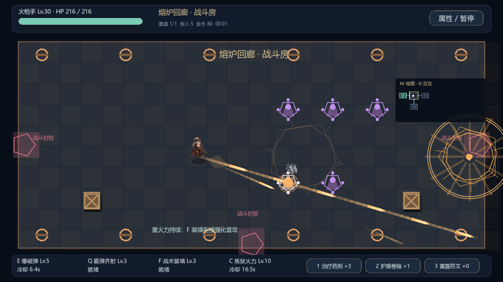

## giant-2

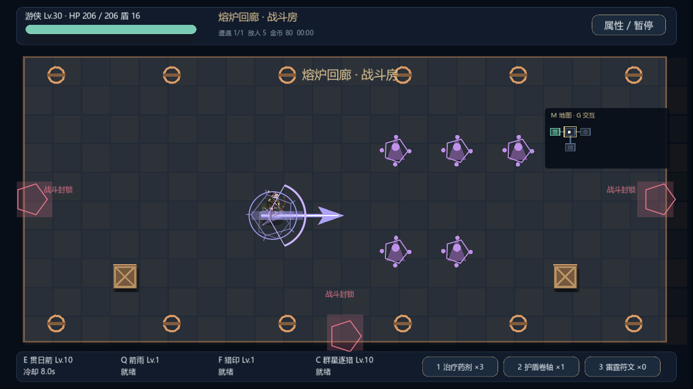

## ultimate-2-active

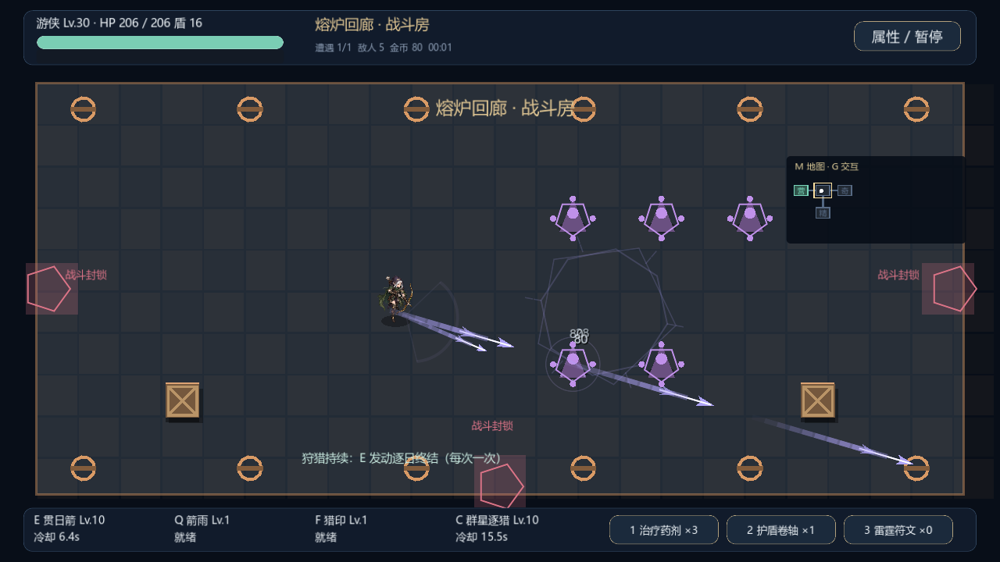

## event

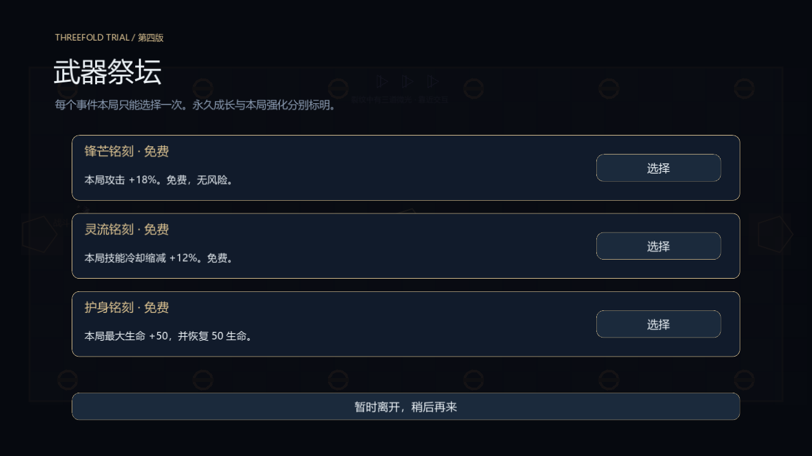

## map

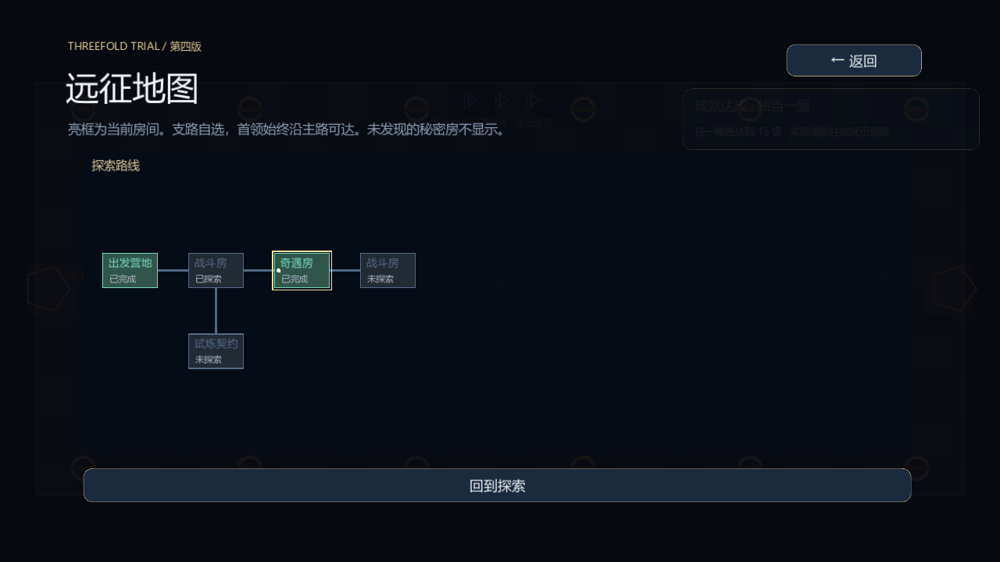

## talents

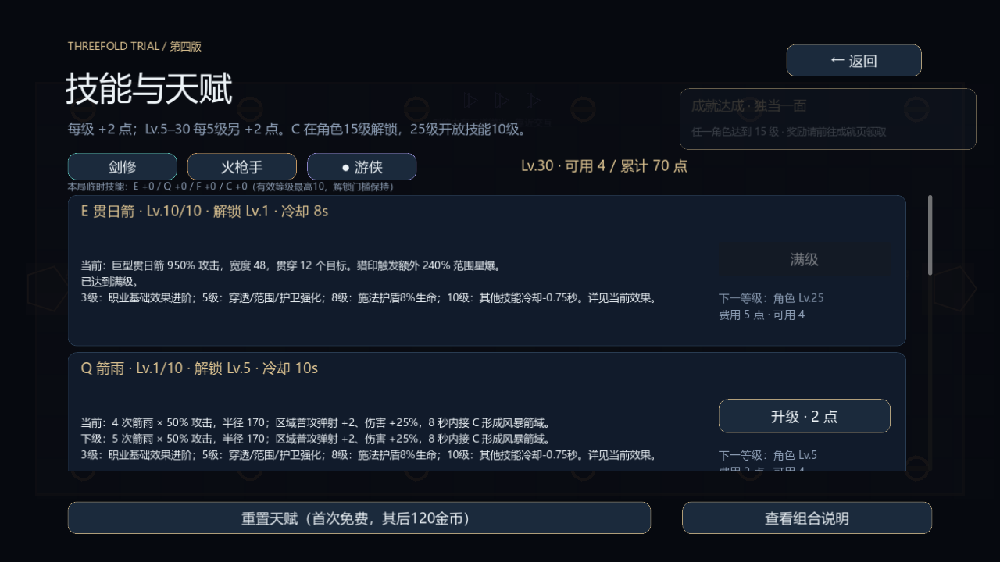

## camp

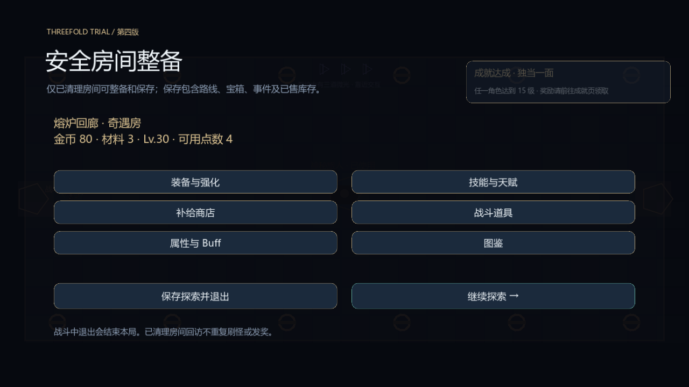

## combos

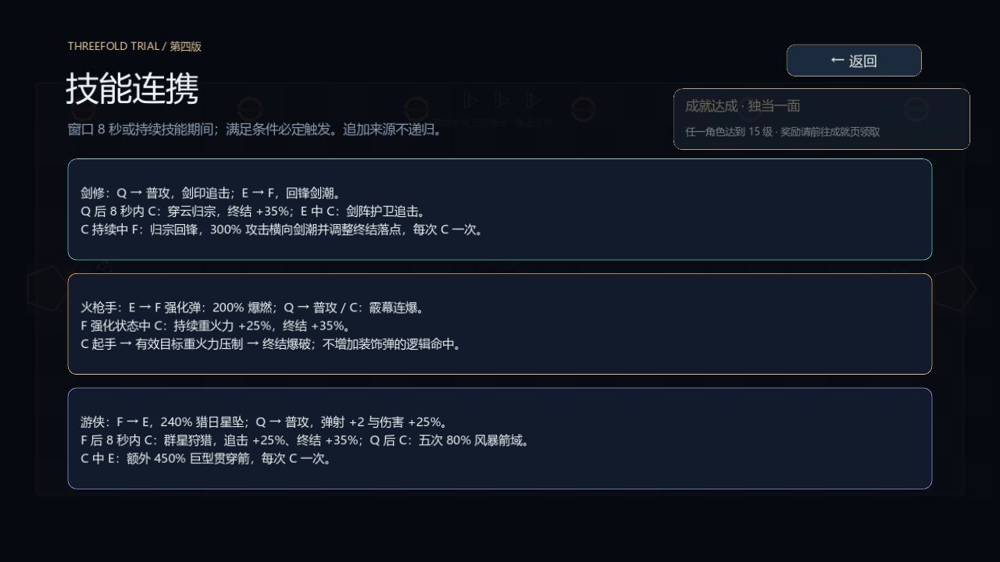

技能演示录像另附：v4-skills.avi，27秒，1280×720、60FPS，包含起手、持续和终结。录像使用训练靶，未剪辑伪装成通关体验。
