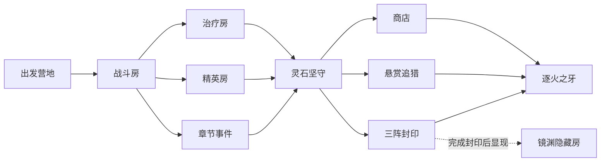

# 0.7.0「九流化境」更新日志

- 三职业新增九套流派、36条互斥技能进化路线和三级进化。
- 奖励加入有限重抽、进化保障和当前流派关联 Buff 保护。
- 新增灯笼芽灵、藤团子、爆栗兽、纸鹤师四种战术小怪。
- 新增迅捷、坚甲、爆裂、指挥、吸能、镜影六种精英词缀。
- 新增灵石坚守、悬赏追猎、三阵封印三种房间目标。
- 第二章改为多分支样板，加入安全、精英、剧情、商店、追猎、封印、Boss和隐藏房。
- 新增守灯人砚秋、三职业 Boss 台词、逐火之牙称号和镜渊伏笔。
- 史诗与传奇装备新增九种流派机制；加入章节软保底和首领定向部位。
- HUD显示目标进度和炽焰流热量；坚甲精英加入破甲，重攻击加入短硬直与分级震动。
- 新增详细战报，记录伤害来源、暴击、最高伤害、闪避、承伤、治疗、敌群、路线、奖励与收益。
- 存档升级至版本5，增量保留角色、天赋、装备、强化、货币、章节、图鉴、成就和设置。

本版没有引入新的外部美术或音频资源；新增画面均复用工程已有、已记录许可的素材与代码绘制效果。

## 第二章路线

